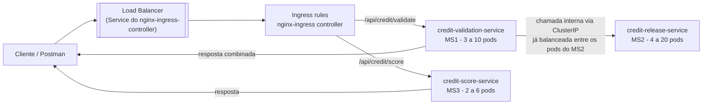

# Arquitetura de Estudo: Microserviços de Crédito

Projeto de estudo com 3 microserviços em **Quarkus**, pensado para praticar comunicação entre serviços, autoscaling (HPA) e roteamento/load balancing no Kubernetes, seguindo o mesmo padrão GitOps (Helm + ArgoCD) já usado no `nginx-web`.

## Visão geral



Fluxo: o cliente bate primeiro no **load balancer** — que é o `Service` na frente do `nginx-ingress-controller` — antes mesmo de chegar nas regras de `Ingress`. Dali, o controller roteia por path pra **MS1 ou MS3**. Se o MS1 aprovar, ele chama o **MS2 internamente** (via Service `ClusterIP`, DNS interno do cluster) para calcular o valor liberado, e devolve a resposta consolidada ao cliente. O MS2 não precisa ficar exposto no Ingress — continua 100% interno. O **MS3 é independente**: não conversa com MS1 nem MS2, serve só pra praticar múltiplos paths/services no mesmo Ingress.

> **Duas posições, dois papéis:** o LB na entrada (bloco `LB` acima) é **um só**, compartilhado por todo o cluster, e resolve "como o tráfego externo chega". Já o balanceamento MS1→MS2 é feito pelo `Service` `ClusterIP` do MS2 (não aparece como uma caixa separada no diagrama porque é uma propriedade built-in de qualquer Service, não um componente à parte) e resolve "como distribuir entre réplicas de um serviço interno". Ver a seção **Load Balancer** mais abaixo para o detalhe de cada camada.

---

## MS1 — `credit-validation-service`

Valida se o cliente é elegível a crédito.

**Regra de negócio:** `idade > 30` → elegível (`approved: true`); caso contrário, reprovado.

**Contrato (REST/JSON):**
```
POST /validate
Request:  { "customerId": "123", "age": 35 }
Response: { "customerId": "123", "approved": true, "reason": "AGE_OK" }
```

Se `approved = true`, o próprio MS1 chama o MS2 (`POST /release`) e agrega o valor liberado na resposta final ao cliente.

**Dimensionamento (HPA):**
| Parâmetro | Valor |
|---|---|
| minReplicas | 3 |
| maxReplicas | 10 |
| Métrica sugerida | CPU 70% |

---

## MS2 — `credit-release-service`

Calcula o valor de crédito a liberar, com base numa faixa etária mais granular que a do MS1.

**Regra de negócio (valores de exemplo, ajustáveis via `ConfigMap`):**
| Faixa etária | Valor liberado |
|---|---|
| 20 ≤ idade < 30 | X = R$ 1.000 |
| 30 ≤ idade < 40 | Y = R$ 3.000 |
| idade ≥ 40 | Z = R$ 5.000 |
| idade < 20 | Reprovado (0) |

**Contrato (REST/JSON):**
```
POST /release
Request:  { "customerId": "123", "age": 35 }
Response: { "customerId": "123", "creditAmount": 3000, "tier": "30-40" }
```

**Dimensionamento (HPA):**
| Parâmetro | Valor |
|---|---|
| minReplicas | 4 |
| maxReplicas | 20 |
| Métrica sugerida | CPU 70% |

> **Nota de estudo:** a regra do MS1 (só aprova `idade > 30`) e a faixa `20-30` do MS2 nunca se encontram nesse fluxo encadeado — é proposital para você perceber, na prática, como regras de negócio divergentes entre times/serviços geram inconsistência. Um exercício interessante é decidir e ajustar isso (ex: mudar o MS1 para `idade >= 20`, ou tratar a faixa 20-30 como "aprovação condicional").

---

## MS3 — `credit-score-service`

Serviço espelho simples e **independente** do fluxo de crédito (não chama nem é chamado por MS1/MS2). Serve pra praticar registrar um segundo path/service no mesmo `nginx-ingress`.

**Função:** consulta um score de crédito mockado para o cliente.

**Contrato (REST/JSON):**
```
GET /score/{customerId}
Response: { "customerId": "123", "score": 742 }
```

Implementação sugerida: score gerado de forma determinística a partir do `customerId` (ex: hash simples), sem persistência — suficiente pra fins de estudo.

**Dimensionamento (HPA):**
| Parâmetro | Valor |
|---|---|
| minReplicas | 2 |
| maxReplicas | 6 |
| Métrica sugerida | CPU 70% |

**Exposição via Ingress:** mesmo `Ingress`/host usado pelo MS1 (ou um `Ingress` próprio), com um path adicional:
```yaml
- path: /api/credit/score
  pathType: Prefix
  backend:
    service:
      name: credit-score-service
      port:
        number: 80
```

---

## Namespace e organização dos manifests

Seguindo o padrão do repo (Helm chart por serviço em `charts/`):
```
charts/
  credit-validation-service/
    Chart.yaml
    values.yaml
    templates/
      deployment.yaml
      service.yaml
      hpa.yaml
  credit-release-service/
    Chart.yaml
    values.yaml
    templates/
      deployment.yaml
      service.yaml
      hpa.yaml
      configmap.yaml   # valores X, Y, Z externalizados
  credit-score-service/
    Chart.yaml
    values.yaml
    templates/
      deployment.yaml
      service.yaml
      hpa.yaml
      ingress.yaml
```
Namespace sugerido: `credit-study`.

## Pré-requisito para o HPA funcionar

O `HorizontalPodAutoscaler` depende do **metrics-server** rodando no cluster para coletar CPU/memória dos pods. Em cluster `kind`, ele normalmente não vem instalado por padrão — será necessário instalar antes de testar o autoscaling.

---

## Load Balancer: como encaixar aqui

Existem **duas camadas** de load balancing possíveis, e vale entender a diferença:

### 1. Load balancing que você já tem, automaticamente (L4, interno)

Todo `Service` do Kubernetes (`ClusterIP`) já é, por si só, um load balancer entre os pods de um Deployment. Quando o MS1 chama o MS2 via `http://credit-release-service.credit-study.svc.cluster.local`, o `kube-proxy` distribui as requisições entre todos os pods saudáveis do MS2 (round-robin via iptables/IPVS). Isso já cobre o balanceamento **entre réplicas de um mesmo serviço** — inclusive quando o HPA escalar de 4 para 20 pods, o tráfego é redistribuído automaticamente.

### 2. Load balancing de entrada (L7, externo) — usando o que você já tem

Para expor o MS1 e o MS3 externamente, o caminho mais simples é **reaproveitar o `nginx-ingress` que já está instalado** neste cluster (o mesmo usado pelo `nginx-web`): basta adicionar um novo `Ingress` com host próprio (ex: `credit-api.local`) e paths diferentes (`/api/credit/validate` → MS1, `/api/credit/score` → MS3) apontando pros Services correspondentes. O controller nginx-ingress já atua como um load balancer L7 — ele recebe todo o tráfego externo e distribui entre os pods de cada serviço via o respectivo Service, igual fizemos com o `nginx-web`.

### 3. Se quiser um `Service type: LoadBalancer` "de verdade" (opcional, avançado)

Em cloud (EKS/GKE/AKS), `type: LoadBalancer` provisiona automaticamente um load balancer real (ALB/NLB/GCP LB). Em `kind` (ambiente local, sem cloud provider), esse tipo de Service fica preso em `<pending>` indefinidamente, porque não existe um cloud controller pra atendê-lo.

Pra simular isso localmente, dá pra instalar o **MetalLB** (bare-metal load balancer implementation): ele atribui IPs reais de um pool configurado a Services `type: LoadBalancer`, fazendo eles funcionarem também em `kind`. Isso é um bom exercício complementar, mas **não é necessário** pra esse projeto — o Ingress já resolve o caso de uso de expor o MS1.

**Recomendação prática:** para este estudo, use o `nginx-ingress` existente como load balancer de entrada (mesmo padrão do `nginx-web`), e trate o MetalLB como um exercício extra/opcional caso queira entender `type: LoadBalancer` na prática.

---

## Próximos passos sugeridos

1. Criar os projetos Quarkus (`quarkus create app`) para MS1, MS2 e MS3.
2. Criar os charts Helm (`charts/credit-validation-service`, `charts/credit-release-service`, `charts/credit-score-service`) com Deployment, Service e HPA.
3. Instalar `metrics-server` no cluster (pré-requisito do HPA).
4. Registrar as três Applications no ArgoCD (igual foi feito com `nginx-web`).
5. Criar o `Ingress` do MS1 e do MS3 reaproveitando o `nginx-ingress` (paths diferentes no mesmo host, ou hosts separados).
6. Testar autoscaling gerando carga (ex: `hey` ou `k6`) contra o MS1 e o MS3 e observar o HPA escalando os pods.
